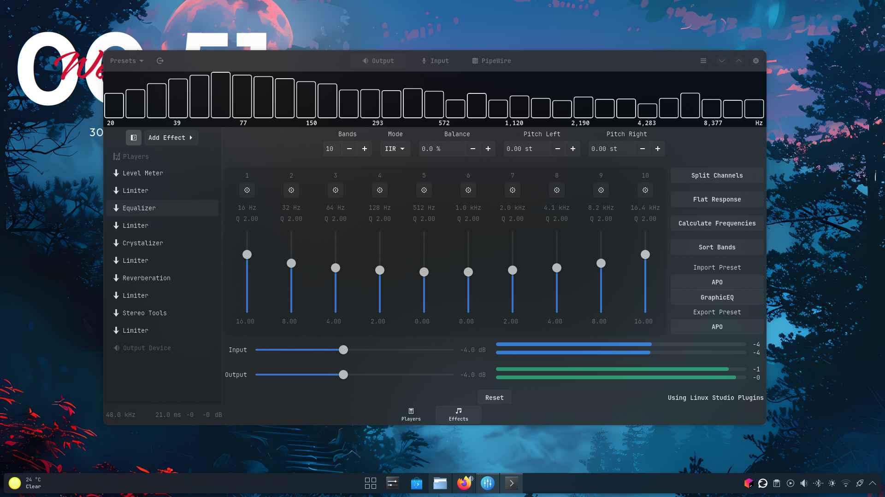

# EasyEffects Equalizer Configuration for Exceptional Sound Quality 🎧

> **Project**: High-Quality Equalizer Preset for EasyEffects on Linux  
> **Repository URL**: [EasyEffects-Binary-Dotfile](https://github.com/MrMegh/Easyeffects-Binary-Dotfile.git)  
> **Description**: This project provides an optimized Equalizer configuration for the [EasyEffects](https://github.com/wwmm/easyeffects) app on Linux, using binary frequency gain adjustments for exceptional sound clarity and performance across devices.

---

## 📋 Table of Contents

- [About](#about)
- [Features](#features)
- [Installation](#installation)
- [Usage](#usage)
- [Screenshots](#screenshots)
- [Videos](#video)
- [Contributing](#contributing)
- [License](#license)

---

## 📖 About

This Equalizer configuration is crafted to enhance sound quality through binary-based frequency adjustments, offering a clear, dynamic, and immersive audio experience. It’s designed for Linux users leveraging the power of EasyEffects, specifically catering to audiophiles, gamers, and media enthusiasts who seek precision in sound reproduction.

---

## 🌟 Features

- **Binary Frequency Gain Adjustments**: Frequency bands are set using binary values for refined tuning and balance.
- **Exceptional Clarity and Quality**: The configuration enhances sound quality by focusing on balanced audio dynamics.
- **Cross-Device Compatibility**: Tuned for a wide range of hardware setups and compatible with various speaker and headphone types.
- **Customizable**: Easily modifiable for personal audio preferences.

---

## 🔧 Installation

1. **Download the Config File**:
   - Clone the repository or download the configuration file (`easyEffects_equalizer.conf`) directly from GitHub:
     ```bash
     git clone https://github.com/MrMegh/Easyeffects-Binary-Dotfile.git
     ```

2. **Import into EasyEffects**:
   - Open EasyEffects, navigate to the *Effects* section, and select *Equalizer*.
   - Import the downloaded configuration file using the *Import Preset* option.

3. **Apply and Save**:
   - Enable the equalizer settings and save the profile within EasyEffects to make the preset your default audio configuration.

---

## ▶️ Usage

1. Launch EasyEffects on your Linux system.
2. Go to the *Equalizer* section and ensure the imported preset is selected.
3. Adjust the preset according to your listening preference, if needed. The configuration works well across various music genres, games, and video content.

---

## 📷 Screenshots

Here are some screenshots to help you visualize the setup and configuration:

- **Equalizer Settings Overview**
  
  


---

## 🎥 Video Sample

Experience the quality of the Equalizer configuration by watching the sample video below. Click the link to play:

- [Sample Video](./videos/video.mkv)

### Original Song
- [Listen to the Original Song]([https://www.example.com/original-song](https://music.youtube.com/watch?v=wlQpmD_If7k&si=iVvJifdh6rExIQtb))


---
## 🤝 Contributing

Contributions, issues, and feature requests are welcome! Please follow these steps for submitting a contribution:

1. Fork the repository.
2. Create a new branch for your feature or bug fix.
3. Commit your changes and push the branch.
4. Create a pull request for review.

---

## 📜 License

This project is licensed under the MIT License - see the [LICENSE](LICENSE) file for details.

--- 

Enjoy an elevated audio experience with EasyEffects! 🎶
